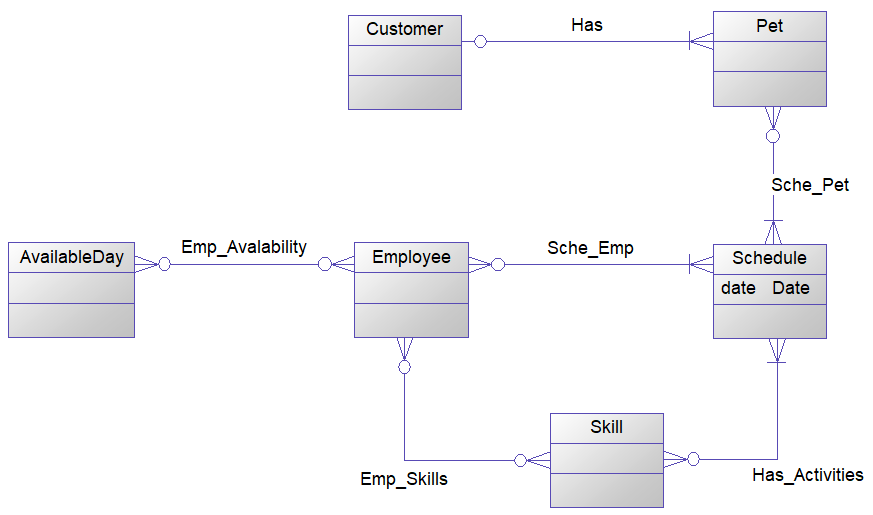
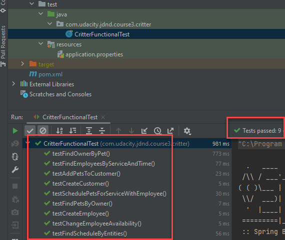

# Pet Scheduler

Pet Scheduler a Software as a Service application that provides a scheduling interface for a small business that takes care of animals. This Spring Boot project will allow users to create pets, owners, and employees, and then schedule events for employees to provide services for pets.

### Design Entities to Represent Data

1. Two different kinds of users - **Employees** and **Customers**.
2. Any type of **pet**, such as cats, dogs, lizards, hedgehogs, toucans, etc. We don't want to discriminate against owners of odd pets!
3. Schedules that indicate **one or more employees** will be meeting **one or more pets** to perform **one or more activities** on **a specific day**.

- **[The requirement in detail](./requirement.md)**
### Purposes

- Understand how to design entities to represent data in databases. In particular, design  relationships between entities that represent associations **OneToOne**, **OneToMany**, **ManyToOne**, and **ManyToMany** with proper annotations related to **fetching**, **cascading**, etc.
- Understand the data flow through layers in a multi-tier architecture and how to expose data to front-end using data transfer objects (**DTO**)
- Understand how to configure data source in Spring, such as connecting external database like MySQL instead of in-memory database H2
- Understand how to use Java persistence API (**JPA**) with the implementation of **Hibernate** to query data

### Results

1. EER Diagram

_The overview of relationships between entities_

2. Test Cases

3. Try a test with [Swagger Docs here](http://159.65.133.69/pets/swagger-ui/index.html) 